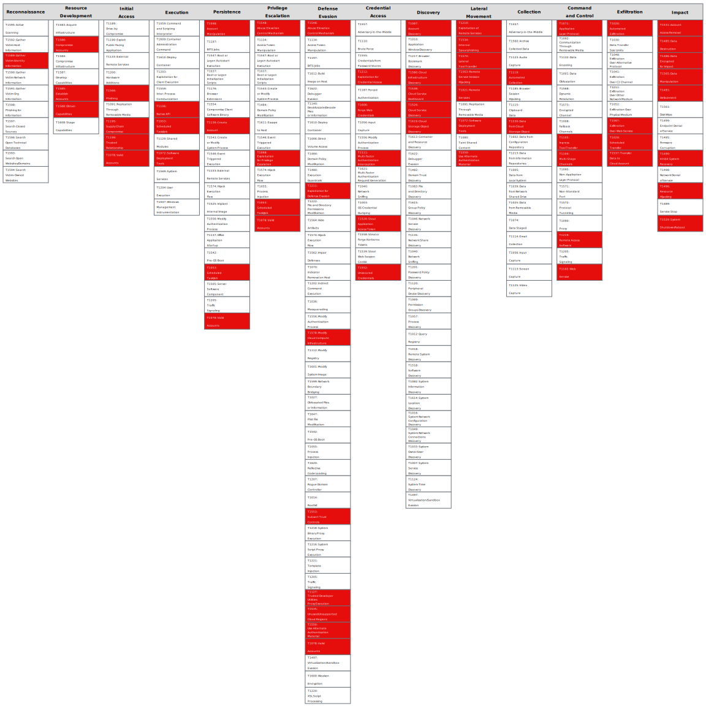

# 3rd party cross environment / account access leading to privilege escalation

This attack path details the trust given to a 3rd party company or resource to access the customer’s cloud environment. Cross environment / account access is usually granted through a middle identity that is also given a set of permissions. In this attack path, the permissions that are given are overly permissive and can lead to privilege escalation from the 3rd party company.

