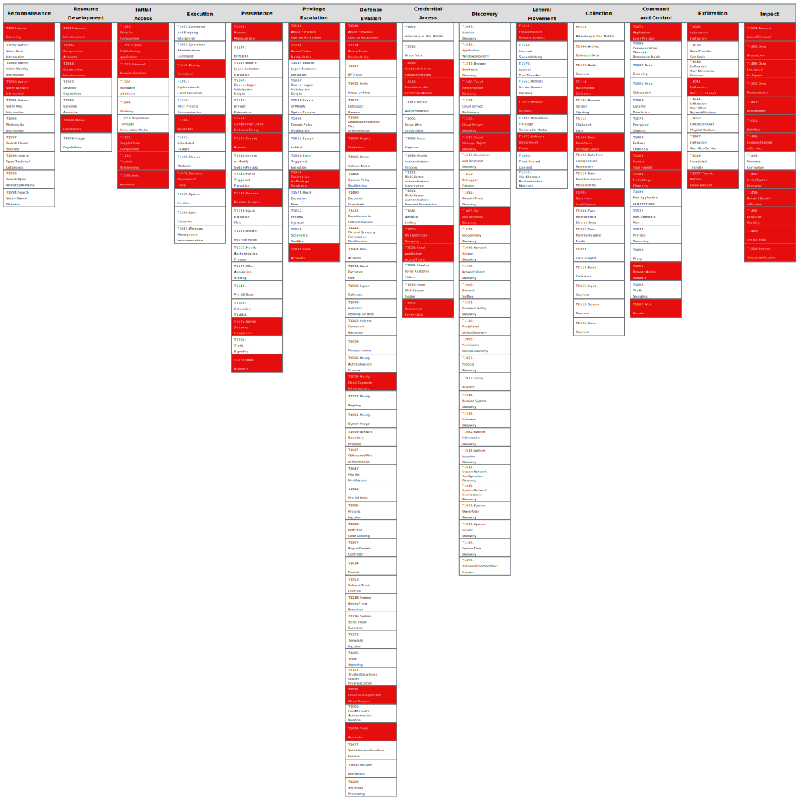

# Cleartext cloud credentials discovered on workload

This attack path details the existence of cleartext cloud credentials such as IAM access keys on a cloud workload. The credentials can be found inside the running workload, in its code, or in its configuration, such as environment variables.

