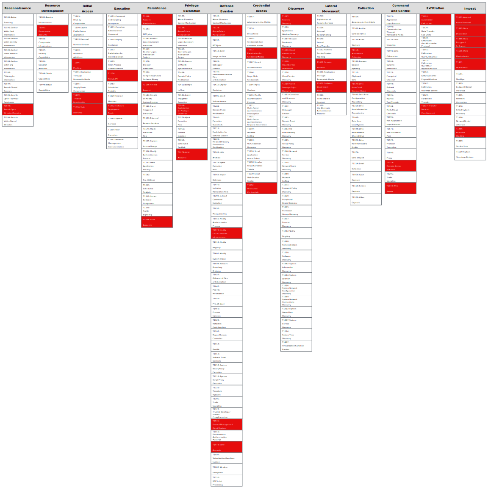

# Identity with bad hygiene

This attack path details the bad hygiene of an entity such as user, role, group, etc. Each identity should have security controls and be properly maintained. A neglected identity can lead to an undetected breach which compromises this identity.

