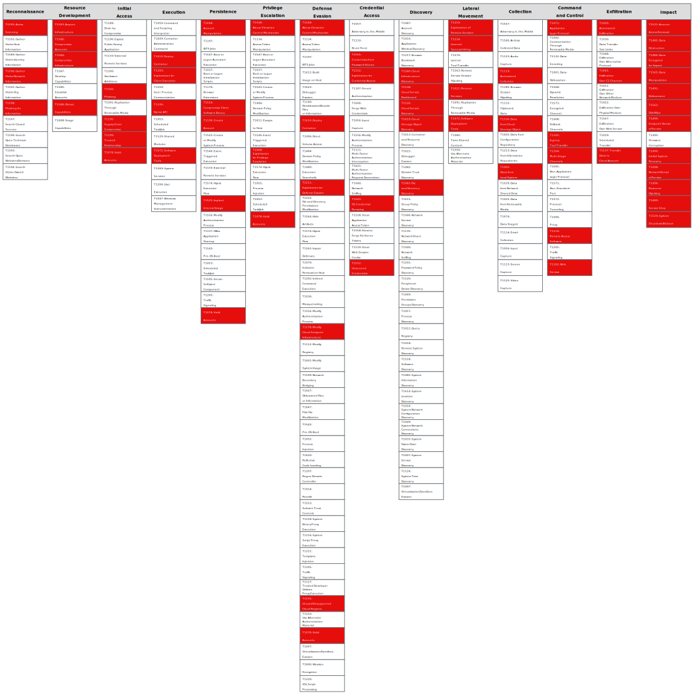

# Private workload with admin permissions

This attack path details the existence of a privately configured workload with admin permissions in the cloud environment. This path enables anyone with access to the workload to leverage permissions and become the environment administrator. 

