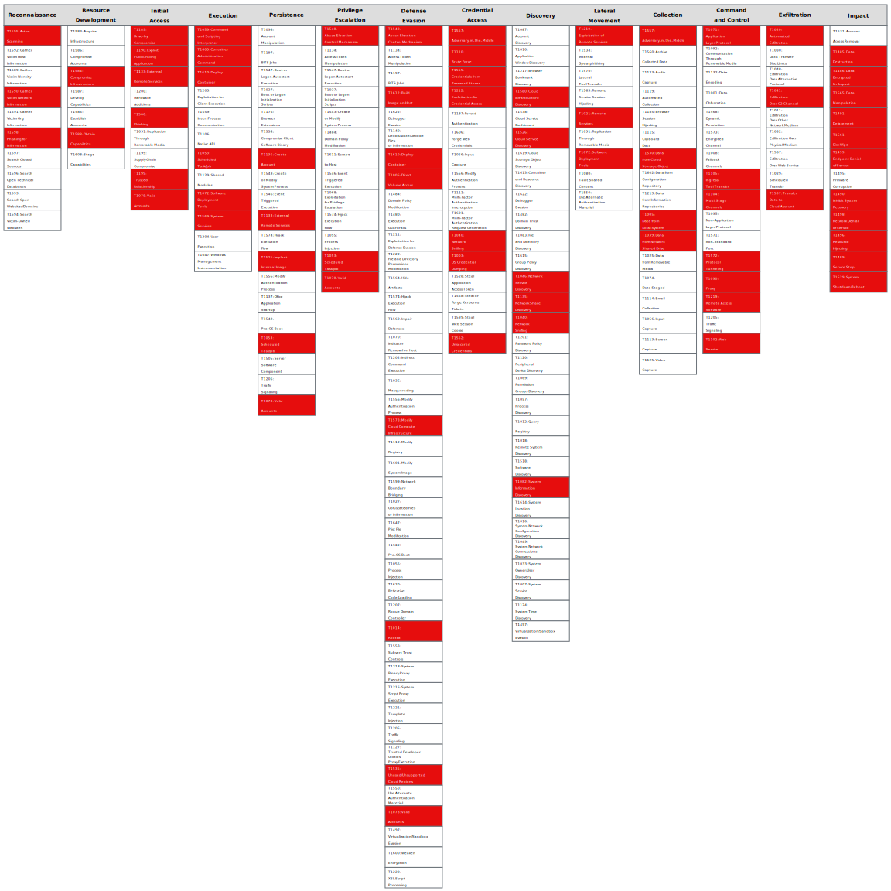

# SSH keys discovered on workload leading to lateral movement

This attack path details the ability to perform a lateral movement in the cloud environment based on SSH keys. This movement ("jump") can be between public and private virtual machines with permissive network access based on poorly stored private SSH keys or sharing the same SSH keys between many virtual machines in one environment.

