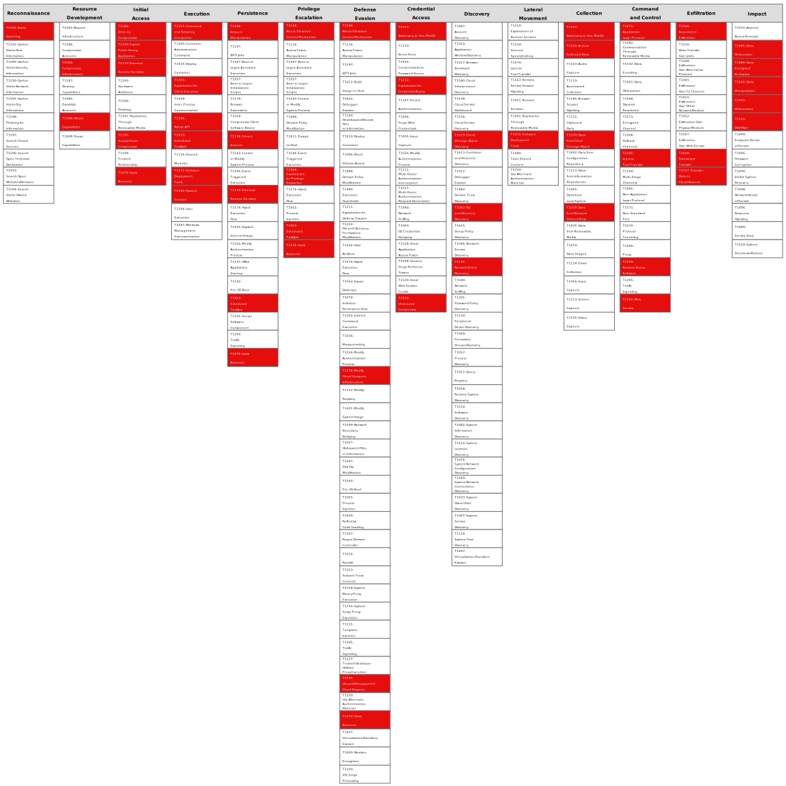

# Unauthenticated public access to data store

This attack path details the existence of cloud hosted storage, databases, or other datastores that are public. When there is no authentication, attackers can exploit it to read and/or write data using common tools to compromise the availability, integrity, or confidentiality of the data stored within.

